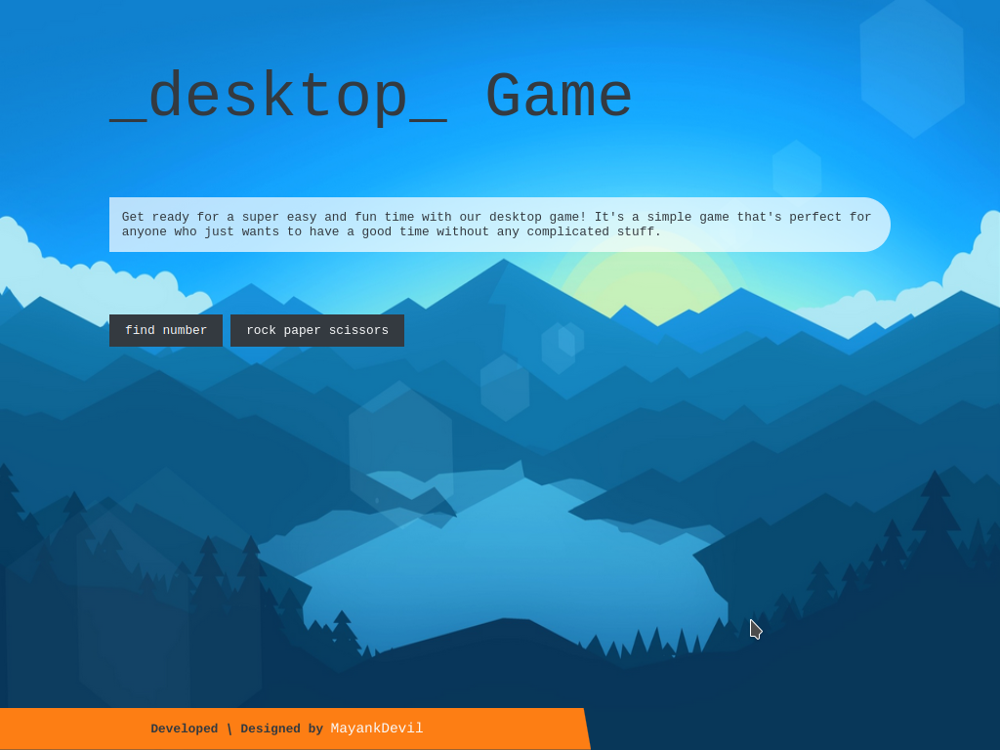

# Project 5

- Name : "Find Rank"

- Description : "A web game for web user that like to play simple games"

- Version : main

- Update : 03-03-2024

- Status : REST

- Responsive : True

- TechStack : { HTML | CSS | JavaScript }

- Thanks : { GitHub | VSCodium | GIMP MayankDevil }

- Collabrate : { Self }

- Design : { Mayank }

- Developer : { Mayank }

- CopyRight : { Mayank }

- URL : https://mayankdevil.github.io/Project-5/

- Clone : https://github.com/MayankDevil/Project-5.git

- Download : https://github.com/MayankDevil/Project-5/archive/refs/heads/main.zip

---

### Home Page

## About

_click play button and select random number that given_

#### Project Look & Feel

#### Not Responsive

_Our immersive desktop gaming platform, crafted with ethical precision, prioritizes an impressive gaming experience; please note, it is optimized for desktop play and may not be responsive on mobile or small tablets due to the intricacies of the game design._

#### Theme

_"Experience an inclusive and ethically designed desktop game project that refrains from specifying a color scheme to cater to diverse gaming sections."_

### Warning

** normal copyright **

__" Please refrain from unauthorized coping or downloading of content, as such actions are subject to legal consequences and potential charges.We encourage respectful and responsible use of the resouces prvided for learning purpose."__

